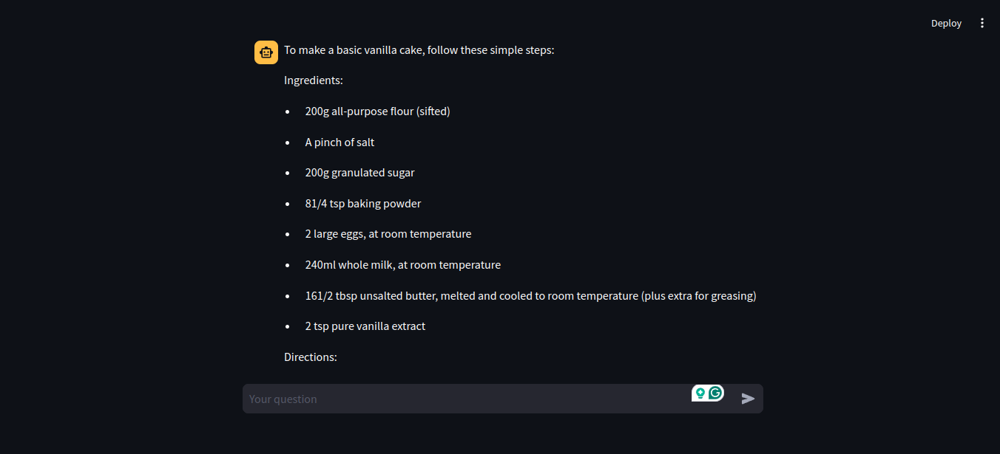
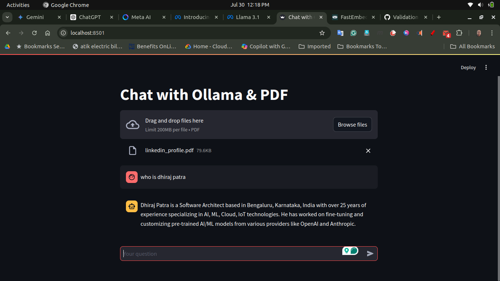
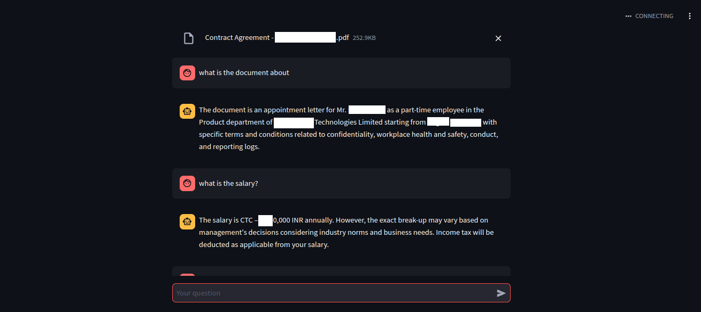

# Ollama and Phi3 Based Chatbot Application

This repository contains a Streamlit application that leverages the Ollama and Phi3 models to create an interactive chatbot. The application is designed to provide fast and accurate responses to user queries.

## Features
- Interactive chatbot interface
- Model optimization for faster inference
- Efficient resource management with Docker

## Prerequisites
- Docker
- Docker Compose
- Streamlit

## Installation

1. **Clone the repository:**
    ```bash
    git clone https://github.com/your-repo/ollama_phi3_chatbot.git
    cd ollama_phi3_chatbot
    ```

2. **Build and run the Docker container:**
    ```bash
    sudo docker-compose up --build
    ```

3. Now we need to **pull the phi3 or other model by our ollama container**. Get more details https://github.com/ollama/ollama and https://hub.docker.com/r/ollama/ollama

`docker exec -it ollama ollama run phi3`


4. **Open the application:**
    Open your browser and go to `http://localhost:8501` to see the Streamlit application.

## Usage

1. Enter your input in the text box.
2. Click the "Predict" button to get the response from the chatbot.

## Optimization Strategies

To ensure the chatbot runs efficiently, the following strategies have been employed:

- **Model Optimization**: Quantization and pruning to reduce model size and improve speed.
- **Efficient Loading**: Lazy loading and caching of models and predictions.
- **Hardware Acceleration**: Utilization of GPU/TPU and multi-threading for faster computation.
- **Streamlit Optimization**: Use of `st.cache` for function caching and batch processing of requests.
- **Asynchronous Processing**: Handling multiple requests concurrently using asynchronous processing.

## Application Screenshot





## Contributing

If you wish to contribute to this project, please fork the repository and create a pull request with your changes.

## License

This project is licensed under the MIT License. See the [LICENSE](LICENSE) file for details.

## Acknowledgements

- Thanks to the creators of the Ollama and Phi3 models.
- Special thanks to the Streamlit team for providing an excellent framework for building interactive applications.
