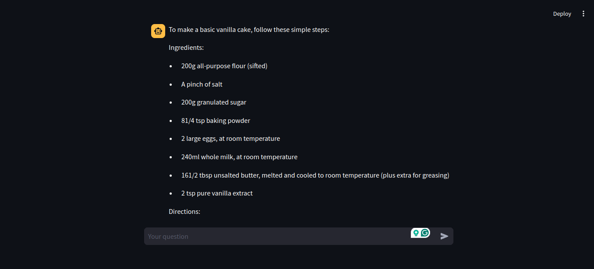
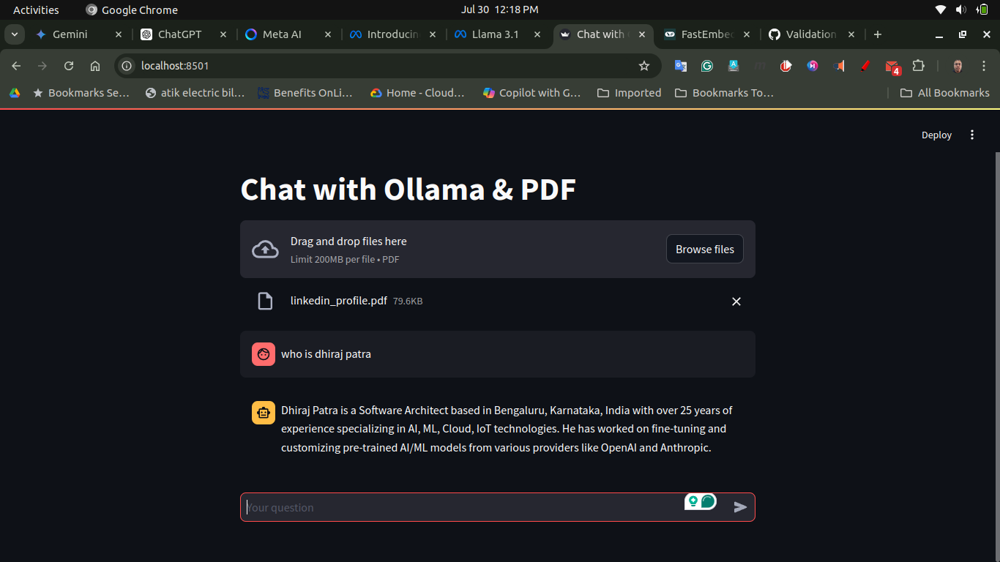
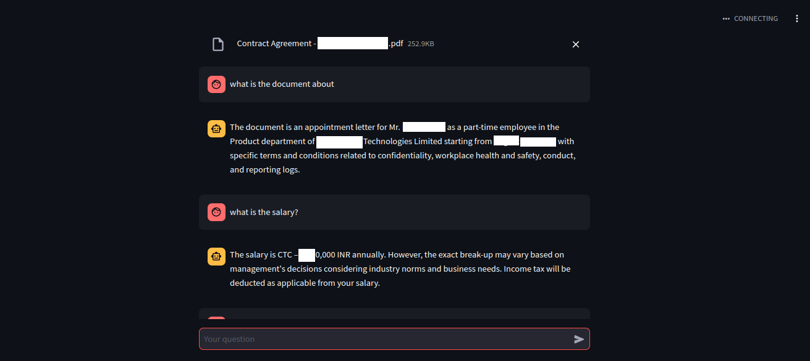
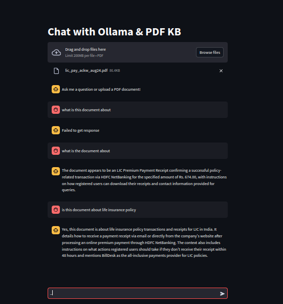
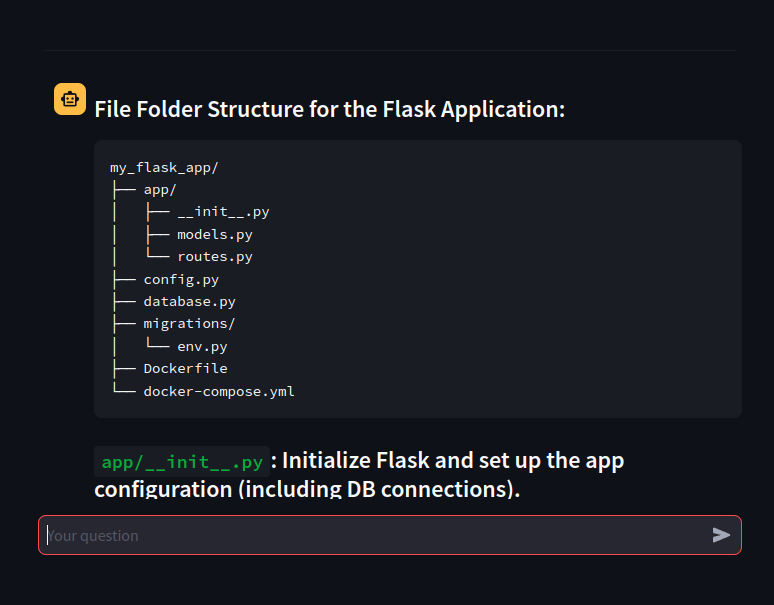
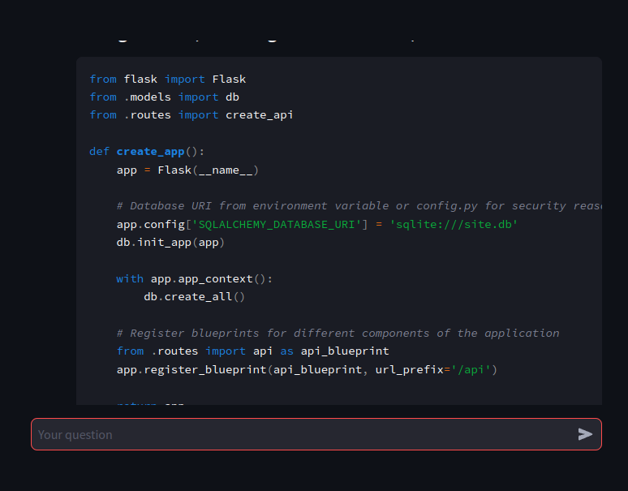
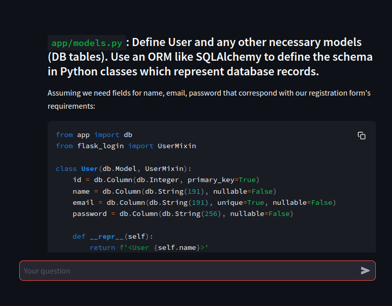
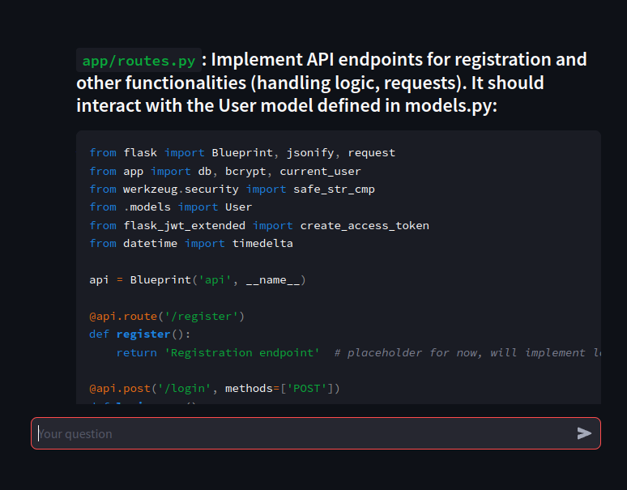
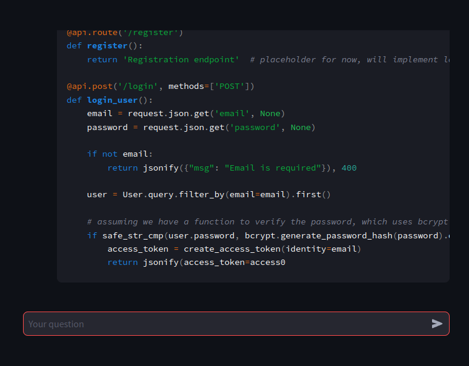

# Ollama and Phi3 Based Microservices Chatbot Application

This repository contains a Flask-based application using the Ollama and Phi3 models to create an interactive chatbot. The application is designed to provide fast and accurate responses to user queries through a microservices architecture, where the front-end and back-end are isolated. Unlike other setups where Streamlit and Ollama might be combined, our system uses REST APIs for communication between the front-end and back-end, allowing for greater flexibility and modularity.

## Features
- Interactive chatbot interface
- Model optimization for faster inference
- Efficient resource management with Docker
- Microservices architecture with isolated front-end and back-end components
- Redis cache and KNN algorithm based similar questions search from cache

## Prerequisites
- Docker
- Docker Compose
- Flask (for back-end)
- Front-end application framework (e.g., React)

## Installation

1. **Clone the repository:**
    ```bash
    git clone https://github.com/your-repo/ollama_phi3_chatbot.git
    cd ollama_phi3_chatbot
    ```

2. **Build and run the Docker container:**
    ```bash
    sudo docker-compose up --build
    ```

3. **Pull the Phi3 or other model with the Ollama container:**
    Get more details at [Ollama GitHub](https://github.com/ollama/ollama) and [Ollama Docker Hub](https://hub.docker.com/r/ollama/ollama)
    ```bash
    docker exec -it ollama ollama run phi3
    ```

4. **Open the application:**
    - The Flask back-end will be running on port `8000`.
    - Your front-end application should make REST API calls to this back-end service.

## Usage

1. **Front-End Interaction:**
    - The front-end application communicates with the back-end using REST APIs.
    - It sends user queries to the back-end and displays responses.

2. **Session Management:**
    - Each session is managed independently, allowing users to interact with different sessions concurrently.

## Optimization Strategies

To ensure the chatbot runs efficiently, the following strategies have been employed:

- **Model Optimization:** Quantization and pruning to reduce model size and improve speed.
- **Efficient Loading:** Lazy loading and caching of models and predictions.
- **Hardware Acceleration:** Utilization of GPU/TPU and multi-threading for faster computation.
- **Asynchronous Processing:** Handling multiple requests concurrently using asynchronous processing.

## Application Screenshot












## Change branch to code for code and backend application from front end code

## Contributing

If you wish to contribute to this project, please fork the repository and create a pull request with your changes.

## License

This project is licensed under the MIT License. See the [LICENSE](LICENSE) file for details.

## Acknowledgements

- Thanks to the creators of the Ollama and Phi3 models.
- Special thanks to the Flask and Docker communities for providing excellent tools for building and managing services.
